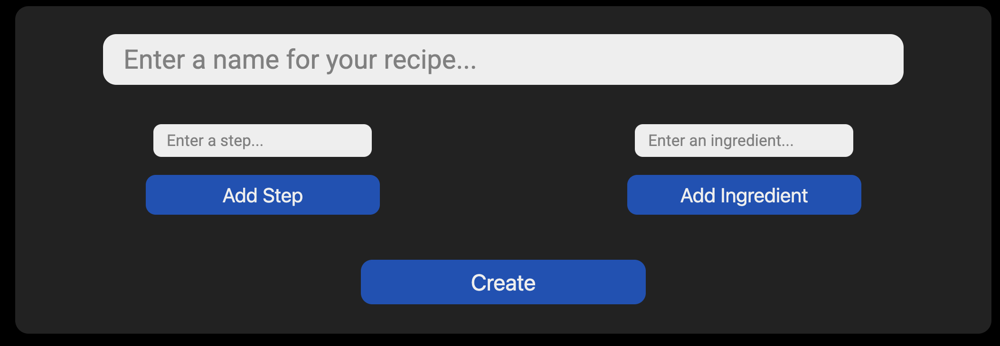

<h1>Recipe Web App</h1>
<h2>This simple web app allows you to create recipes with varying numbers of steps and ingredients</h2>
 
<h3>The initial page:</h3>

 
<h3>Creating pizza recipe:</h3>

 
<h3>Updating Pizza Recipe</h3>

 
<h3>Adding a Second Recipe</h3>

 
<h3>Deleting a Recipe</h3>

 
<h3>Reading all Recipes (Page Reload)</h3>

